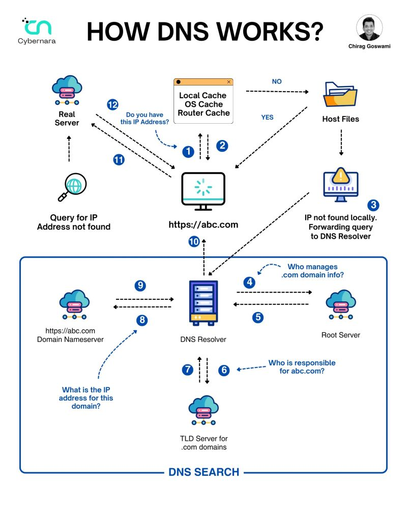

# http-under-the-hood


## What browser does  in the backend when you search a website?

A website doesn't load instantly. In just milliseconds, the browser performs several technical steps to load shorterloop.com..

---

## Step 1: DNS Lookup
The browser first checks its cache for the IP address of shorterloop.com. If it's not found, it queries a DNS server, which translates the domain name into its IP address.

Result:
shorterloop.com → 199.36.158.100

Think of DNS as your phone's contact list—it converts a name into the actual number.





---

## Step 2: TCP Connection &  TLS Handshake
Using the IP address, the browser connects to the server through TCP on port 443 (HTTPS). It then performs a TLS handshake, where both the browser and server verify each other and set up a secure, encrypted connection.

After this step, all data shared between them is kept safe and private.

---

## Step 3: Sending the HTTP Request
The browser sends an HTTP GET request to the server,asking for the homepage of shorterloop.com .

GET / HTTP/1.1
Host: shorterloop.com
Accept: text/html
Connection: keep-alive

---

## Step 4: Recieving the HTTP Response
The server processes the request and sends back a response with a status code indicating the result.

Common status codes:

200 OK → The requested resource is returned.
304 Not Modified → The browser can use its cached copy.
404 Not Found → The requested resource doesn't exist.

For shorterloop.com, the server returned 304 Not Modified, meaning the browser already had the latest version stored, so it reused the cached copy instead of downloading it again.
---

## Step 5: Rendering the webpage 
After receiving the HTML, the browser starts building the webpage. It first creates the DOM from the HTML, then downloads the required CSS, JavaScript, images, fonts, and other assets. Once everything is available, it applies the styles, runs the JavaScript, calculates the page layout, and finally renders the fully interactive webpage on your screen.

Performance:

Total Network Requests: 67
Page Load Time: 685 ms

Even though these steps sound lengthy, modern browsers complete them in just a few hundred milliseconds, making the website appear to load almost instantly.


---

## Network Requests Observed - shorterloop.com

### 1. HTML Document

**Request**
```
GET /
Accept: text/html
User-Agent: Chrome Browser
```

**Response**
```
Status: 304 Not Modified
Content-Type: text/html
```

---

### 2. JavaScript File

**Request**
```
GET /lozad.min.js
Accept: */*
User-Agent: Chrome Browser
```

**Response**
```
Status: 200 OK
Content-Type: application/javascript
```

---

### 3. CSS File

**Request**
```
GET /fonts.css
Accept: text/css
User-Agent: Chrome Browser
```

**Response**
```
Status: 200 OK
Content-Type: text/css
```

---

### 4. CSS File

**Request**
```
GET /main.css
Accept: text/css
User-Agent: Chrome Browser
```

**Response**
```
Status: 200 OK
Content-Type: text/css
```

---

### 5. CSS File

**Request**
```
GET /styles.css
Accept: text/css
User-Agent: Chrome Browser
```

**Response**
```
Status: 200 OK
Content-Type: text/css
```

## DNS Lookup Output

Command: nslookup shorterloop.com

Server:  reliance.reliance
Address: 2405:201:680d:d2be::c0a8:1d01

Non-authoritative answer:
Name:    shorterloop.com
Address: 199.36.158.100
